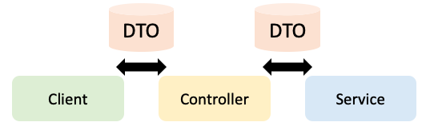

# VO(Value Object)
  VO(Value Object)는 값 자체를 나태내는 객체라는 의미를 갖고 있다. 값 자체를 표현하기 때문에 불변객체로 생성해야 하며, setter 같은 성격 변조 가능성이 있는 메소드는 존재하면 안된다. 또한 두 객체의 주소값이 달라도 같은 값을 담고 있다면 같은 객체로 봐야하기 때문에 hashCode()와 equals()를 오버라이딩하여 반드시 재정의 해야한다.
  
  ```java
    @Getter @Setter
    @Alias("item")
    class ItemVO {
        private Long id;
        private int price;
            private int stockQantity;
        private String category;

        @Override
        public boolean equals(Object o) {
            if (this == o) return true;
            if (o == null || getClass() != o.getClass()) return false;
            Item item = (Item) o;
            return Objects.equals(id, item.id);
        }

        @Override
        public int hashCode() {
            return Objects.hash(id);
        }
    }
  ```
  
# DTO(DATA Transfer Object)
  DTO(DATA Transfer Object)는 Layer(Controller, View, Business Layer)간 데이터 교환하는 객체이다. 

  

  로직을 가지고 있는 데이터 객체로, getter/setter 메소드만 가진 클래스를 의미한다. 또한 어떠한 비즈니스 로직을 가져서는 안되며, 저장, 검색, 직렬화, 역직렬화 로직만을 가져야 한다.

  아래 코드처럼 setter를 가지는 경우 가변객체로 활용할 수도 있다.
```java
  public class MemberDto {
      private String name;
      private int age;

      public String getName() {
          return name;
      }

      public void setName(String name) {
          this.name = name;
      }

      public int getAge() {
          return age;
      }

      public void setAge(int age) {
          this.age = age;
      }
} 
```
이때 setter의 경우 변조 가능성이 있기 때문에 아래와 같이 생성자로 값을 넣어주도록 하게 하면 전달하는 과정에서 변조가 불가능하다.

```java
  public class MemberDto {
      private final String name;
      private final int age;

      public MemberDto(String name, int age) {
          this.name = name;
          this.age = age;
      }

      public String getName() {
          return name;
      }

      public int getAge() {
          return age;
      }
  }
```

# DTO vs VO
```markdown

|*분류*|*DTO*|*VO*|
|----|----|----|
|*정의*|레이어간 데이터 전송용 객체|값 자체 표현|
|*가변성*|가변 또는 불변 객체|불변 객체|
|*로직*|로직을 포함할 수 없다|로직을 포함할 수 있다|

```